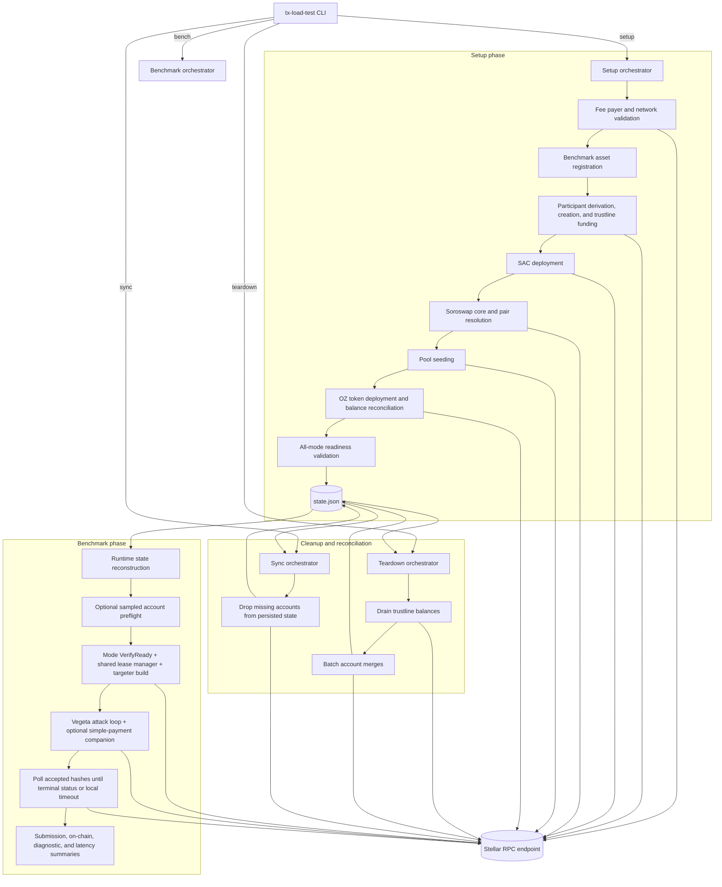

# tx-load-test architecture

`tx-load-test` is a three-phase workflow built around a persisted state file.
Setup prepares the ledger once, bench reuses that state repeatedly, and teardown
or sync reconcile the state file with what exists on-chain.

## Runtime model

- `PersistedState` stores the minimal ledger identity and derivation metadata needed to reconstruct benchmark state without storing secrets.
- `state.FromPersistedState` rebuilds live keypairs, assets, contract IDs, and the shared RPC client from the fee-payer seed and persisted indices.
- `setup` persists after each step so partial progress can be resumed or cleaned up.
- `bench` never mutates the state file; it optionally samples participant-account existence, validates runtime readiness, runs one or two workloads, then reports submission and on-chain outcomes.
- `teardown` and `sync` update the state file to reflect any accounts that remain after partial cleanup or network drift.

## Benchmark internals

- Each benchmark mode implements `Mode.VerifyReady` and `Mode.NewTargeter`.
- Soroban modes pre-simulate representative invocations to capture padded fees, resources, auth, and footprints.
- The shared runner drives a Vegeta attack, records optional NDJSON traces, fee-bumps benchmark submissions, queues accepted hashes, and polls until terminal status or a local poll timeout.
- Soroswap builds four directional swap templates across two benchmark pools and round-robins traffic across them for an even split.
- End-of-run output includes submit-time error breakdowns, on-chain result-code breakdowns, normalized diagnostic summaries, e2e latencies, and Vegeta metrics.
